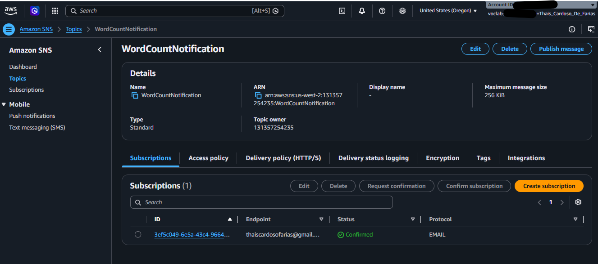
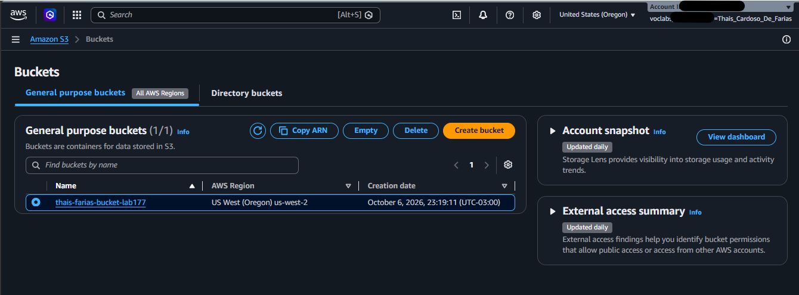
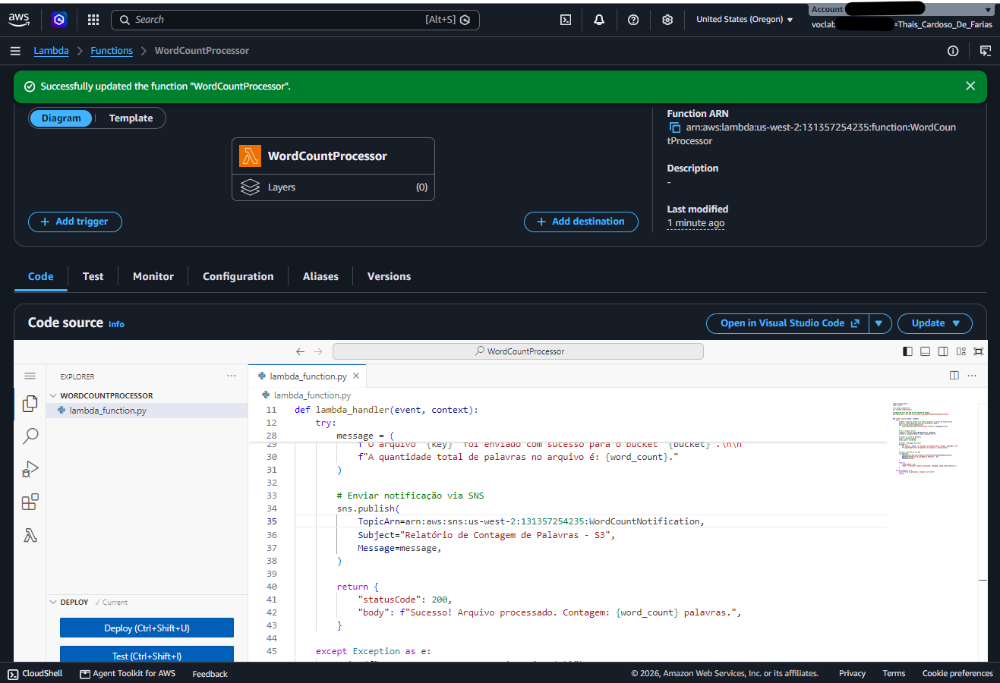
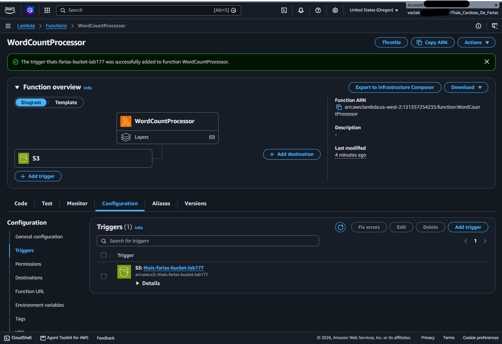
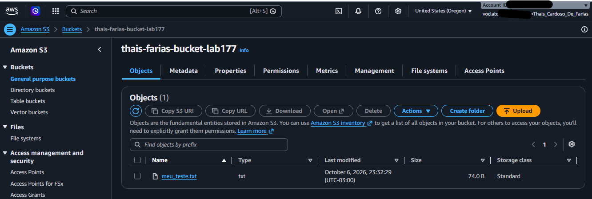
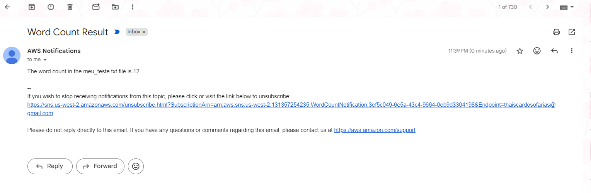

# 🚀 Automação Event-Driven na AWS: Processamento de Arquivos S3 com AWS Lambda e Amazon SNS

Projeto prático desenvolvido para demonstrar a criação de uma arquitetura *Event-Driven* (orientada a eventos) e *Serverless* utilizando serviços da AWS. Sempre que um novo arquivo de texto é enviado para um bucket no **Amazon S3**, uma função **AWS Lambda** é disparada automaticamente para contar o número de palavras e enviar o resultado via **Amazon SNS** por e-mail.

---

## 🛠️ Serviços AWS Utilizados

* **Amazon S3 (Simple Storage Service):** Armazenamento de objetos para upload dos arquivos de texto.
* **AWS Lambda:** Computação serverless executada em Python 3.12 para processamento do arquivo e contagem de palavras.
* **Amazon SNS (Simple Notification Service):** Serviço de mensageria para envio de e-mails de notificação com os resultados.
* **AWS IAM (Identity and Access Management):** Gerenciamento de permissões e roles de execução da Lambda (`LambdaAccessRole`).

---

## 📐 Arquitetura da Solução

1. **Upload:** O usuário realiza o upload de um arquivo `.txt` no Amazon S3.
2. **Gatilho (Trigger):** O S3 gera um evento `s3:ObjectCreated:*` que dispara a execução da AWS Lambda.
3. **Processamento:** A função Lambda lê o arquivo do S3, processa a quantidade de palavras no texto e formata a mensagem.
4. **Notificação:** A Lambda publica a mensagem no tópico do Amazon SNS, que entrega o e-mail ao destinatário confirmado.

---

## 🚀 Passo a Passo da Implementação e Evidências

### 1. Configuração do Canal de Mensageria (Amazon SNS)
Primeiramente, foi criado o tópico `WordCountNotification` no Amazon SNS com o protocolo de assinatura por e-mail. A assinatura foi confirmada com sucesso via caixa de entrada, permitindo o recebimento das notificações.



---

### 2. Criação do Repositório de Arquivos (Amazon S3)
Em seguida, foi criado o bucket no Amazon S3 para atuar como repositório de entrada dos arquivos de texto.



---

### 3. Desenvolvimento do Código e Permissões (AWS Lambda)
A função `WordCountProcessor` foi criada no AWS Lambda utilizando o runtime Python 3.12. Para garantir as permissões de leitura no S3 e publicação no SNS, associou-se a role de execução `LambdaAccessRole`.



---

### 4. Integração Event-Driven (S3 Trigger)
Foi configurado o gatilho (trigger) no Amazon S3 diretamente na função Lambda. Assim, qualquer novo objeto criado (`s3:ObjectCreated:*`) invoca a função de forma automática e assíncrona.



---

## 🧪 Teste de Execução e Resultados

### 5. Upload do Arquivo de Texto no S3
Para validar o fluxo, foi realizado o upload de um arquivo `.txt` diretamente na raiz do bucket S3.



---

### 6. Notificação por E-mail Recebida
Em questão de segundos após o upload, a função Lambda processou o arquivo e publicou a notificação no SNS, entregando o e-mail com a contagem exata de palavras.



---

## 💻 Código da Função Lambda (`lambda_function.py`)

```python
import urllib.parse
import boto3

s3 = boto3.client("s3")
sns = boto3.client("sns")

# ARN do tópico SNS para envio das notificações
SNS_TOPIC_ARN = "arn:aws:sns:us-west-2:131357254235:WordCountNotification"


def lambda_handler(event, context):
    try:
        # Obter o nome do bucket e a chave do arquivo a partir do evento do S3
        bucket = event["Records"][0]["s3"]["bucket"]["name"]
        key = urllib.parse.unquote_plus(
            event["Records"][0]["s3"]["object"]["key"], encoding="utf-8"
        )

        # Ler o arquivo do S3
        response = s3.get_object(Bucket=bucket, Key=key)
        content = response["Body"].read().decode("utf-8")

        # Processar a contagem de palavras
        words = content.split()
        word_count = len(words)

        # Formatação exata da mensagem de retorno
        message = f"The word count in the {key} file is {word_count}."

        # Publicação no Amazon SNS
        sns.publish(
            TopicArn=SNS_TOPIC_ARN,
            Subject="Word Count Result",
            Message=message,
        )

        return {"statusCode": 200, "body": message}

    except Exception as e:
        print(f"Erro ao processar o arquivo: {str(e)}")
        raise e
        ```
## 📂 Estrutura do Repositório

.
├── lambda_function.py      # Código em Python executado pela AWS Lambda
├── README.md               # Documentação detalhada do projeto
└── screenshots/            # Evidências em imagem da implementação
    ├── 01-sns-topic-subscription.png
    ├── 02-s3-bucket-setup.png
    ├── 03-lambda-function-code.png
    ├── 04-s3-event-trigger.png
    ├── 05-s3-file-upload.png
    └── 06-email-notification.png

## 🧠 Aprendizados e Conclusões
Computação Serverless: Aplicação prática do conceito de execução de código orientada à demanda sem provisionamento de servidores.

Arquiteturas Event-Driven: Implementação da reatividade a eventos de storage (upload no S3) para automação de pipelines.

IAM & Segurança na AWS: Aplicação de roles de execução para permitir a comunicação segura entre serviços (S3, Lambda e SNS).

